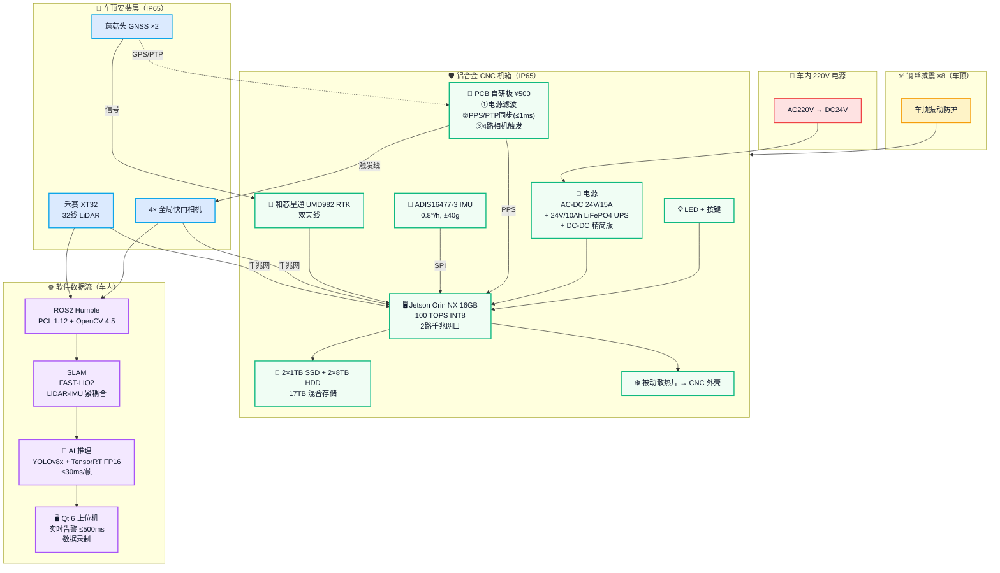
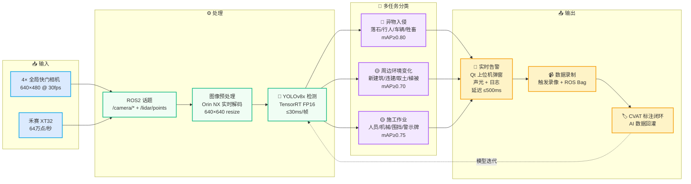

# 车载式铁路周边环境巡检设备 — 项目研发规划 V5

**编制日期 2026-09-18** · 团队扩充 4 人 · BOM 配件重构 · 时间线 2026-10-15 → 2027-10-14 · 总预算 ≈ 208.7 万元

---

## 📋 V5 核心变更（相对 V4.1）

1. **团队扩充为 4 人**：赵庆尧 60K + 嵌入式 25K + PC端 18K + 测试 5K
2. **法定福利政策调整为 50% 比例 × 50% 基数**（工资 < 8000 按实际）
3. **补齐配件重算**：电源 400 / 散热被动 600 / 网口 0 / 线缆 2000 / 结构 2000 / LED 30 → 单台 BOM 53,460 元
4. **时间线重启**：2026-10-15 → 2027-10-14，3 人 12-31 前陆续到岗
5. **总预算锚定 208.7 万元**（人工 175.5 万 / BOM 11.84 万 / AI 物料 2.3 万 / 办公 19.07 万）

---

## ① 接手方案 — 从硬件到软件，车载单一产品线全部接手

**接手定位：** 基于现有车载式铁路周边环境巡检设备单一产品线，**从硬件到软件全栈接管**，12 个月内交付 V1.0 + AI V2.0 完整版。

### 1.1 接手范围（5 大模块）

| # | 模块 | 接手内容 | 负责人 | 完成节点 |
|---|---|---|---|---|
| 1 | 硬件平台 | 整机结构 / 传感器组合 / 电源 / 存储 / 外壳 / PCB | 赵庆尧 | ★A4 第一代样机 |
| 2 | 嵌入式固件 | STM32 同步触发 / PPS-PTP / 相机触发 / IMU SPI | 嵌入式 | ★A4 |
| 3 | 上位机软件 | Qt6 GUI / ROS2 Humble / PCL / OpenCV / SLAM | PC 端 | ★A6 装车 |
| 4 | AI 异常识别 | YOLOv8 多任务 / TensorRT / CVAT / 上位机集成 | PC 端 + 测试 | ★A11 验收 |
| 5 | 上车联调 & 测试 | 车顶安装 / 振动 / 高低温 / 多场景 / IP65 / 实测验证 | 全员 | ★A8 多场景实测 |

### 1.2 接手方法论（4 阶段）

- **Phase A 摸底（M1-M2 / 10-11 月）**：BOM 校对 + 工艺评估 + 代码审查 + 团队招聘 + 关键器件复购
- **Phase B 重建（M3-M4 / 12-1 月）**：人员陆续到岗 + 采购 + 预研 + 设计冻结 + PCB 投板
- **Phase C 装车（M5-M8 / 2-5 月）**：传感器调试 + 外壳组装 + 第一代样机 + 上车联调 + 上位机 V1
- **Phase D 验收（M9-M12 / 6-10 月）**：迭代 V1/V2/V3 + 多场景实测 + AI 验收 + 项目交付

### 1.3 关键接手交付物（13 项）

| # | 交付物 | 完成节点 | # | 交付物 | 完成节点 |
|---|---|---|---|---|
| 1 | 需求规格说明书 V1.0 | ★A1（10-31） | 8 | AI 训练报告 | ★A11（2027-10） |
| 2 | 硬件原理图 + PCB 文件 | ★A3（2027-01） | 9 | 样机 V1.0 测试报告 | ★A4（2027-04） |
| 3 | 外壳结构图（v1→v3） | 2027-01~09 | 10 | 上车联调报告 | ★A6（2027-05） |
| 4 | 嵌入式固件源码 | ★A4（2027-04） | 11 | 多场景实测报告 | ★A8（2027-08） |
| 5 | PC 端软件安装包 | ★A12（2027-10） | 12 | AI 模型 V2.0 验收报告 | ★A11（2027-10） |
| 6 | SLAM 算法说明 | ★A6（2027-05） | 13 | 项目总结报告 + 量产包 | ★A12（2027-10-14） |
| 7 | AI 算法说明（V2.0 多任务） | ★A11（2027-10） |  |  |  |

---

## ② 预计研发周期 — 12 个月（2026-10-15 → 2027-10-14）

**启动 2026-10-15 → 验收 2027-10-14**。前 6 月硬件样机（M5-M7），第 8 月上车联调（M8），AI 异常识别 M2 起贯穿 11 个月。3 人 12-31 前陆续到岗。

### 2.1 12 个月甘特图

| 月份 | M1 10月 | M2 11月 | M3 12月 | M4 1月 | M5 2月 | M6 3月 | M7 4月 | M8 5月 | M9 6月 | M10 7月 | M11 8月 | M12 9-10月 |
|---|---|---|---|---|---|---|---|---|---|---|---|---|
| **硬件（赵庆尧）** | 摸底+校对 | 采购准备 | 采购+预研 | 设计冻结 | 调试+投板 | 外壳组装 | 整机测试 | 装车 | 迭代V1 | 迭代V2 | 迭代V3 | 验收 |
| **嵌入式（25K / 5年）** | - | 招聘 | 到岗+培训 | STM32基础 | 同步触发 | 相机驱动 | 整机调试 | 联调 | 迭代 | 迭代 | 迭代 | 验收 |
| **PC 端（18K / 2年）** | - | 招聘 | 到岗 | 环境搭建 | SLAM仿真 | Qt基础 | 上位机 | 联调 | 迭代 | 迭代 | 迭代 | 验收 |
| **测试（5K）** | - | - | 到岗 | 培训 | 测试用例 | 功能测试 | 集成测试 | 上车测试 | 实测 | 实测 | 实测 | 验收测试 |
| **🤖 AI 异常识别** | - | 预研 | 预研 | 预训练 | 推理集成 | 采集500张 | 微调V1 | 采集3000张 | 采集 | 微调V2 | 实测 | AI验收 |

### 2.2 关键里程碑（14 个）

| 编号 | 里程碑 | 时间 | 交付 |
|---|---|---|---|
| ★A1 | 项目启动 + 招聘发布 | 2026-10-31 | JD + 需求规格说明书 V1.0 |
| ★A2 | 团队陆续到岗 | 2026-12-31 前 | 3 人全部入职（测试可较晚） |
| ★A3 | 硬件设计冻结 | 2027-01-31 | 原理图 + PCB + 外壳 |
| ★A5 | 外壳组装 + 整机测试 | 2027-03-31 | 整机装配 |
| ★A4 | **★ 第一代样机** | 2027-04-30 | 整机联调 + 嵌入式 + PCB 启动 |
| ★A6 | 上车联调 + 上位机 V1 | 2027-05-31 | 完整上位机 + 实车装配 |
| ★A7 | 迭代 V1（6 月） | 2027-06-30 | 优化版 |
| ★A7-AI | 🤖 AI V1.0（mAP≥0.65） | 2027-06 末 | YOLOv8 多任务 |
| ★A8 | 迭代 V2（7 月） | 2027-07-31 | 二次优化 |
| ★A8-AI | 🤖 现场数据采集 | 2027-07~08 | ≥3000 张精标 |
| ★A9 | 迭代 V3（8 月） | 2027-08-31 | 三次优化 + 多场景实测 |
| ★A9-AI | 🤖 AI V2 微调 | 2027-08 中 | mAP@0.5 ≥ 0.75 |
| ★A10 | 多场景实测 | 2027-08-31 | 白天/夜间/雨/雾 |
| **★A11** | **★ AI 验收** | 2027-10-14 | V2.0 多任务 + 实时告警 |
| **★A12** | **★ 项目验收交付** | 2027-10-14 | 客户签字 + 量产包 |

---

## ③ 预计 BOM 成本 — 单台 5.35 万 + 分层采购 11.84 万

### 3.1 单台 BOM 明细（53,460 元）

| # | 部件 | 型号 | 单价(元) | 单台小计(元) |
|---|---|---|---|---|
| 1 | 激光雷达 | 禾赛 XT32 | 18,000 | 18,000 |
| 2 | IMU | ADIS16477-3 | 4,500 | 4,500 |
| 3 | 定位模组 | 和芯星通 UMD982 | 340 | 340 |
| 4 | GNSS 天线 | 蘑菇头 ×2 | 260 | 520 |
| 5 | 工控主板 | Jetson Orin NX 16GB（自带 2 路网口） | 8,000 | 8,000 |
| 6 | 工业摄像头 | ≤1000 元全局快门 ×4 | 1,000 | 4,000 |
| 7 | 存储（混合） | 2×1TB SSD + 2×8TB HDD | — | 3,900 |
| 8 | CNC 外壳 | 骨架 + 分体 CNC | 6,000 | 6,000 |
| 9 | 锂电池组 | 24V/10Ah LiFePO4 + BMS | 2,000 | 2,000 |
| **用户指定部件小计** |  |  |  | **47,260** |
| A | 同步与采集控制 | PCB 自研 + PPS + 线缆 |  | 1,170 |
| B | 电源系统 | DC-DC + 浪涌 + ATS（精简版） |  | 400 |
| C | 散热系统（被动） | 散热片直接连外壳 |  | 600 |
| D | 网络与通信 | 主板自带 2 路网口（无需扩展） |  | 0 |
| E | 连接器与线缆 | 防水插头 + 网线 + 同轴 |  | 2,000 |
| F | 结构与安装 | 钢丝减震 + 支架 + 密封 |  | 2,000 |
| G | 监控与指示（LED） | LED 指示灯 + 按键 |  | 30 |
| **补齐配件小计** |  |  |  | **6,200** |
| **单台 BOM 合计** |  |  |  | **53,460 元 ✅ ≤ 6 万目标** |

### 3.2 分层采购总额（118,400 元）

| 类别 | 份数 | 小计(元) | 采购逻辑 |
|---|---|---|---|
| A. 核心传感器 | 2 | 46,200 | XT32+IMU+UMD982+蘑菇头 |
| B. 计算+存储 | 2 | 27,800 | Orin NX + 存储 + 电池 |
| C. 相机 | 2 | 8,000 | 4 相机 ×2 |
| D. 外壳 | 4 次 | 24,000 | CNC v1→v4 迭代 |
| E. 配件 | 2 | 12,400 | 单台配件 6,200 ×2 |
| **硬件总计** |  | **118,400 元** | 节省 ≈ 50%（vs 4 倍统一） |

---

## ④ 预计研发成本 — 三栏口径

**V5 口径**：研发成本按"人工 / 物料 / 办公及其他"三栏拆分。物料指 AI 训练，办公及其他含招聘、办公、差旅等。

### 4.1 人工成本（1,754,801 元 — 84.1%）

| 类别 | 月薪(元) | 月数 | 直接薪资(元) | 福利基数 | 14月福利(元) |
|---|---|---|---|---|---|
| 赵庆尧（技术总负责） | 60,000 | 14 | 840,000 | 封顶 25,023 | 83,201 |
| 嵌入式（5 年经验） | 25,000 | 14 | 350,000 | 封顶 25,023 | 83,125 |
| PC 端（2 年经验） | 18,000 | 14 | 252,000 | 封顶 25,023 | 59,850 |
| 测试（不要求经验） | 5,000 | 14 | 70,000 | 实际 5,000 | 16,625 |
| **直接薪资小计** |  |  | **1,512,000** |  |  |
| 法定福利（公积金 12% + 社保 35.5% = 47.5% × 50% 比例 × 50% 基数 = 11.875%） |  |  |  |  | 242,801 |
| **4.1 人工成本合计** |  |  |  |  | **1,754,801** |

> 💡 **福利政策说明**：公积金 12% + 社保（养老 16% + 医疗 8% + 失业 0.5% + 工伤 0.2% + 生育 0.8%）= 47.5%。公司侧按 **50% 比例 × 50% 基数** 缴纳（工资 < 8000 按实际基数）。封顶基数取天津 2026 参考值 25,023 元。

### 4.2 物料成本 — AI 训练（23,000 元 — 1.1%）

| 类别 | 数量 | 单价(元) | 小计(元) |
|---|---|---|---|
| 云端 GPU 租赁（A100/A800） | 4 月 | 2,000 | 8,000 |
| AI 数据标注外包（3000 张） | 3000 张 | 5 | 15,000 |
| **4.2 AI 训练物料合计** |  |  | **23,000** |

### 4.3 办公及其他（190,740 元 — 9.1%）

| 类别 | 金额(元) |
|---|---|
| 招聘费 | 8,000 |
| 设备折旧 | 12,000 |
| 耗材 / 测试租赁 | 30,000 |
| 差旅 | 25,000 |
| 通信 / 团建 | 18,000 |
| 商保 + 杂费 | 10,000 |
| 办公场地 | 0（远程 + 客户场地为主，不租用固定天津办公室） |
| 小计 | 103,000 |
| 不可预见费（5% 人工） | 87,740 |
| **4.3 办公及其他合计** | **190,740** |

### 4.X 项目总预算汇总

| 成本项 | 金额(元) | 占比 |
|---|---|---|
| 4.1 人工成本 | 1,754,801 | 84.1% |
| 4.2 物料成本（AI 训练） | 23,000 | 1.1% |
| 4.3 办公及其他 | 190,740 | 9.1% |
| **研发投入小计** | **1,968,541** | **94.3%** |
| ③ BOM 采购（独立） | 118,400 | 5.7% |
| **项目总预算** | **2,086,941** | **100% ≈ 208.7 万 ✅** |

---

## ⑤ 性能指标 — 四大维度

### 5.1 点云采集（LiDAR XT32）

| 指标 | 数值 | 指标 | 数值 |
|---|---|---|---|
| 线数 | 32 | 点频 | 640,000 点/秒 |
| 测距范围 | 0.5 ~ 120 m | 水平视场 | 360° |
| 测距精度 | ±2 cm（1σ） | 垂直视场 | 31°（-25°~+6°） |
| 防护等级 | IP6K7 / IP6K9K | 功耗 | 约 10 W |

### 5.2 定位与姿态

| 指标 | 数值 |
|---|---|
| RTK 精度 | **水平 ≤2 cm + 高程 ≤5 cm** |
| IMU 陀螺零偏 | **0.8°/h**（ADIS16477-3） |
| IMU 加速度量程 | ±40 g |
| 采样率 | IMU 1000Hz / RTK 50Hz |

### 5.3 AI 异常识别（验收硬指标）

> 🤖 **验收硬指标**：mAP@0.5 ≥ 0.75，单帧推理 ≤30ms，实时告警延迟 ≤500ms，误报率 ≤5%。

| 任务 | mAP@0.5 | 召回率 | 告警等级 |
|---|---|---|---|
| 异物入侵（落石/行人/车辆/牲畜） | ≥ 0.80 | ≥ 0.85 | 🔴 紧急 |
| 周边环境变化（新建筑/违建/取土/植被/水浸） | ≥ 0.70 | ≥ 0.75 | 🟡 关注 |
| 施工作业（人员/机械/围挡/警示牌） | ≥ 0.75 | ≥ 0.80 | 🟡 关注 |
| **综合验收** | **≥ 0.75** | **≥ 0.80** | — |

### 5.4 系统级性能

| 指标 | 数值 | 指标 | 数值 |
|---|---|---|---|
| 工控算力 | 100 TOPS | 存储容量 | 17 TB |
| 续航（UPS） | ≥1 h | 整机功耗 | ≤80 W |
| 整机重量 | ≤15 kg | 防护等级 | IP65 |
| 工作温度 | -20~60℃ | 同步精度 | ≤1 ms |

---

## ⑥ 元件及核心部件清单详情

| # | 类别 | 部件 | 型号/规格 | 单价(元) | 单台小计(元) |
|---|---|---|---|---|---|
| 1 | 感知 | 激光雷达 | 禾赛 XT32（32线，360°，120m） | 18,000 | 18,000 |
| 2 | 感知 | IMU | ADIS16477-3（0.8°/h，±40g） | 4,500 | 4,500 |
| 3 | 感知 | RTK 模组 | 和芯星通 UMD982（双天线） | 340 | 340 |
| 4 | 感知 | GNSS 天线 | 蘑菇头 ×2 | 260 | 520 |
| 5 | 感知 | 工业摄像头 | ≤1000 元全局快门 ×4 | 1,000 | 4,000 |
| 6 | 算力 | 工控主板 | NVIDIA Jetson Orin NX 16GB（100 TOPS，2 路网口） | 8,000 | 8,000 |
| 7 | 存储 | SSD | 2×1TB SATA SSD | — | 1,400 |
| 8 | 存储 | HDD | 2×8TB 监控级 HDD | — | 2,500 |
| 9 | 结构 | CNC 外壳 | 骨架 + 分体 CNC（铝合金 6061） | 6,000 | 6,000 |
| 10 | 电源 | 锂电池组 | 24V/10Ah LiFePO4 + BMS（UPS 备用） | 2,000 | 2,000 |
| **用户指定 9 项小计** |  |  |  |  | **47,260** |
| A1 | 同步 | PCB 自研一体化板 | 嘉立创 4 层 + STM32H750 | 500 | 500 |
| A2 | 同步 | PPS/PTP 接线 | SMA + 同步线缆 | — | 670 |
| B | 电源 | DC-DC + 浪涌 + ATS | 精简版（400 元） | — | 400 |
| C | 散热 | 被动散热片 | 导热硅脂 + 散热片（直接连外壳） | — | 600 |
| D | 网络 | 无需扩展 | 主板自带 2 路千兆网口 | — | 0 |
| E | 连接 | 防水插头 + 网线 + 同轴 | GX16/20 + Cat6A + 同轴 | — | 2,000 |
| F | 结构 | 钢丝减震 + 支架 + 密封 | 车顶安装组件 | — | 2,000 |
| G | 监控 | LED 指示灯 + 按键 | 电源/状态/告警 LED | — | 30 |
| **补齐配件小计** |  |  |  |  | **6,200** |
| **单台 BOM 合计** |  |  |  |  | **53,460 元** |

---

## ⑦ 主要元件功能（按子系统）

| 子系统 | 元件 | 功能 |
|---|---|---|
| 感知 | 禾赛 XT32 | 360° 周边三维点云采集（32 线 / 64 万点/秒） |
| 感知 | ADIS16477-3 IMU | 姿态/加速度；点云去畸变；RTK 紧耦合 |
| 感知 | UMD982 RTK | 厘米级定位 + 双天线定向 |
| 感知 | 蘑菇头 ×2 | GNSS 信号接收 |
| 感知 | 摄像头 ×4 | 周边 4 方向高清；AI 输入 |
| 算力 | Jetson Orin NX 16GB | 主控（SLAM/AI/Qt） |
| 算力 | 主板自带 2 路网口 | LiDAR + 相机网络直连，无需扩展 |
| 存储 | 2×1TB SSD | 系统 + 缓存 |
| 存储 | 2×8TB HDD | 数据录制 ≥8h |
| 电源 | AC-DC 24V/15A | 主供电 |
| 电源 | DC-DC 降压（精简版） | 24V→12V/5V/19V |
| 电源 | 锂电池 24V/10Ah | UPS 备用 |
| 电源 | ATS 切换 | 外电/电池无缝（<10ms） |
| 结构 | CNC 骨架 + 分体 | 模块化机箱（铝合金 6061） |
| 结构 | 钢丝减震 ×8 | 车顶振动防护 |
| 结构 | 密封硅胶条 | IP65 防护 |
| 结构 | 防水呼吸阀 | 防凝露 |
| 同步 | PCB 自研一体化板 | ①滤波 ②同步（PPS/PTP）③相机触发（详见第 ⑩ 章） |
| 散热 | 被动散热片 → 外壳 | 无风扇设计，利用 CNC 铝合金外壳导热 |
| 指示 | LED + 按键 | 电源/状态/告警 LED（监控在上位机完成） |

---

## ⑧ 项目亮点（当前方案）

1. **团队结构合理（4 人）**：技术总负责（60K）+ 嵌入式 5 年（25K）+ PC 端 2 年（18K）+ 测试（5K），覆盖硬件 / 固件 / 软件 / 测试完整链路。
2. **法定福利"50% × 50%"政策**：在合规前提下最大化员工到手收入（公司侧 11.875% 总系数），预算可控且有竞争力。
3. **补齐配件精简设计**：电源（400）+ 散热（被动 600）+ 网口（0，自带）+ LED（30）+ 线缆（2000）+ 结构（2000）= 6,200 元，单台 BOM 53,460 元。
4. **PCB 自研一体化板**：STM32H750 + 嘉立创 4 层板，单板 500 元，三大功能（滤波 + 同步 + 触发）替代商用 1,020 元方案，节省 51%。
5. **被动散热 + 无交换机设计**：利用 CNC 铝合金外壳导热、主板自带 2 路网口直连，进一步降低 BOM 与维护复杂度。
6. **AI 多任务异常识别（核心增值）**：3 类异常（异物 / 周边变化 / 施工），mAP ≥0.75，总投入 2.3 万（GPU + 标注）。
7. **锂电池 UPS 备用**：<10ms 切换、≥1h 续航，车顶断电无忧。
8. **院校背景一致**：核心成员武大背景（测绘 + 遥感），沟通成本低。

---

## ⑨ 补齐配件 + 关键技术规格

### 9.1-9.7 配件明细（精简版）

| 模块 | 小计(元) | 核心部件 |
|---|---|---|
| A. 同步与采集控制 | 1,170 | PCB 自研板 + PPS + 同步线缆 |
| B. 电源系统（精简） | 400 | DC-DC + 浪涌 + ATS |
| C. 散热系统（被动） | 600 | 散热片 + 导热硅脂，直接连接到 CNC 外壳 |
| D. 网络与通信 | 0 | 主板自带 2 路千兆网口，无需交换机 / 网卡 |
| E. 连接器与线缆 | 2,000 | GX16/20 + Cat6A + 同轴 |
| F. 结构与安装 | 2,000 | 钢丝减震 ×8 + 支架 + 密封 |
| G. 监控与指示 | 30 | 仅 LED 指示灯 + 按键（OLED 已去除，监控在上位机完成） |
| **补齐配件总计** | **6,200** | — |

### 9.8 关键技术规格

| 指标 | 规格 | 指标 | 规格 |
|---|---|---|---|
| 时间同步 | PPS + PTP 双模 | 同步精度 | ≤1 ms |
| SLAM 算法 | FAST-LIO2 | SLAM 备选 | LeGO-LOAM |
| 中间件 | ROS2 Humble | 点云库 | PCL 1.12 |
| 视觉库 | OpenCV 4.5 | AI 模型 | YOLOv8x |
| 推理加速 | TensorRT FP16 | 标注工具 | CVAT |
| 上位机 | Qt 6 | 防护等级 | IP65 |
| 工作温度 | -20~60℃ | 减震 | 钢丝减震 ×8 |

---

## ⑩ PCB 自研一体化板核算 — 500 元实现 3 大功能

### 10.1 PCB 板规格

| 项目 | 规格 |
|---|---|
| PCB 厂商 | **嘉立创 4 层板**（沉金工艺） |
| 尺寸 | 10 cm × 10 cm |
| 主控芯片 | **STM32H750**（ARM Cortex-M7，80 MHz） |
| 打样数量 | 10 片 |
| **单板成本** | **500 元**（含 PCB + 主控 + 元器件贴片） |

### 10.2 三大功能

- **① 电源滤波**：π 型 LC + EMI 抑制（≥40 dB）
- **② 时间同步**：PPS 输入/输出 + GPS/PTP（≤1 ms 精度）
- **③ 相机触发**：4 路 GPIO 隔离输出（光耦 TLP181 + ULN2803）

### 10.3 单板成本核算（500 元分解）

| 项目 | 小计(元) |
|---|---|
| PCB 板（嘉立创 4 层 10×10cm） | 80 |
| STM32H750 主控 | 60 |
| 电源滤波器件（LC + TVS） | 40 |
| PPS 调理电路 | 30 |
| 4 路光耦（TLP181） | 20 |
| ULN2803 达林顿 | 8 |
| SMA 接口 ×5 | 75 |
| 电源端子 / 接插件 | 40 |
| 无源器件（电阻电容） | 30 |
| 晶振 + 滤波电容 | 15 |
| SMT 贴片 + 测试 | 80 |
| 固件烧录 + 测试治具 | 22 |
| **单板成本合计** | **500 元** |

### 10.4 首批 10 片总投入（5,000 元）

PCB 打样 800 + 主控+元器件 3,180 + SMT 800 + 测试治具 220 = **5,000 元**。

### 10.5 对比商用方案

商用 FPGA 板 + 触发器 + 滤波器 ≈ **1,020 元/套** vs 自研 **500 元/板**，**节省 51%**。额外收益：完全可控 + 国产化。

---

## ⑪ 系统框架 + AI 异常识别训练预算

### 11.1 系统整体架构（Mermaid 流程图）



### 11.1.b AI 数据流图（Mermaid 流程图）



### 11.2 系统框架（文字版）

```
┌─────────────────────────────────────────────────────────┐
│                   🚗 车载安装层（车顶）                  │
│  蘑菇头 ×2   禾赛 XT32   4×全局快门相机                 │
└────┬─────────────────────┬───────────────────┬──────────┘
     │ GPS/PTP             │ 千兆网             │ 触发线
     ▼                     ▼                   ▼
┌─────────────────────────────────────────────────────────┐
│              🛡️ 铝合金 CNC 机箱（IP65）                  │
│  ┌─────────────────────────────────────────────────┐    │
│  │ Jetson Orin NX 16GB (100 TOPS) + ADIS16477-3 IMU │    │
│  │ 2×1TB SSD + 2×8TB HDD (17TB 混合存储)            │    │
│  │ UMD982 RTK                                       │    │
│  │ PCB 自研一体化板（500元）                        │    │
│  │   ① 电源滤波 ② 时间同步（PPS/PTP） ③ 相机触发   │    │
│  │ 24V/10Ah 锂电池（UPS 备用） + DC-DC 精简电源     │    │
│  │ 被动散热片 → CNC 外壳导热（无风扇）              │    │
│  └─────────────────────────────────────────────────┘    │
│            ↓ 钢丝减震器 ×8（车顶振动防护）              │
└────┬────────────────────────────────────────────────────┘
     │ AC220V → DC24V（外供电）
     ▼
┌─────────────────────────────────────────────────────────┐
│                  ⚙️ 软件数据流（车内）                  │
│                                                         │
│  4×相机 + LiDAR → ROS2 Humble 中间件                   │
│       ↓                                                 │
│  SLAM 算法（FAST-LIO2，LiDAR-IMU 紧耦合）              │
│       ↓                                                 │
│  AI 推理（YOLOv8x + TensorRT FP16，≤30ms/帧）          │
│       ↓                                                 │
│  多任务输出（异物 / 周边变化 / 施工，mAP ≥0.75）       │
│       ↓                                                 │
│  Qt 6 上位机 → 实时告警（≤500ms 延迟）+ 数据录制       │
└─────────────────────────────────────────────────────────┘
```

### 11.3 AI 多任务定义

- **异物入侵**：落石 / 行人 / 车辆 / 牲畜 / 抛洒物（距轨道中心 ≤10m）🔴 紧急
- **周边环境变化**：新建筑 / 违建 / 取土 / 植被 / 水浸（前后帧差异 ≥30%）🟡 关注
- **施工作业**：施工人员 / 机械 / 围挡 / 警示牌（保护区内）🟡 关注

### 11.4 AI 训练预算（23,000 元）

| 类别 | 金额(元) |
|---|---|
| 云端 GPU 租赁（A100/A800）× 4 月 | 8,000 |
| AI 数据标注外包（3000 张 × 5 元） | 15,000 |
| **总计** | **23,000** |

> 注：Orin NX 100 TOPS 推理算力免购置（已在 BOM 中）

### 11.5 AI 训练时间线

| 阶段 | 时间 | 数据量 | 里程碑 |
|---|---|---|---|
| 预研期 | M2-M3（11-12 月） | 公开数据集 | 框架选型 + 基础 demo |
| 预训练 | M4（1 月） | 公开 1 万张 | CVAT 工具就绪 |
| 采集 1 | M5-M6（2-3 月） | 500 张现场 | 推理引擎集成 Orin NX |
| 微调 V1 | M7（4 月） | 2000 张精标 | ★A7-AI V1.0（mAP ≥0.65） |
| 采集 2 | M8-M10（5-7 月） | 3000 张 | ★A8-AI 数据扩展 |
| 微调 V2 | M11（8 月） | 5000 张 | ★A9-AI V2（mAP ≥0.75） |
| 验收 | M12（9-10 月） | 5000 张 | ★A11-AI 验收 + 实时告警 |

---

## ⑫ 风险与权衡

### 12.1 风险分级

**🔴 高风险：**
- **招聘延迟（12-31 死线）**：嵌入式 5 年经验候选人稀缺，缓解：10-15 启动招聘 + 猎头加速
- **硬件 Month 4 未达标**：第一代样机卡在 4 月，缓解：Month 1 即开始关键器件采购
- **上车联调拖期（5 月）**：缓解：Month 1 末即启动铁路局协调

**🟡 中风险：**
- **SLAM 精度**：缓解：M4 仿真 + 备选 LeGO-LOAM
- **PC 端单人多任务**：缓解：候选人 AI + Qt 全栈 + 测试岗分担
- **AI 训练时间紧**：缓解：预训练 + 现场微调（5000 张即可达 mAP≥0.75）
- **PCB 一次成功率**：缓解：10 片批量 + 备件
- **测试到岗晚**：M3 才到岗，缓解：早期由 PC 端 + 赵庆尧承担测试任务

**✅ 关键优势：**
- 赵庆尧 11 年 SLAM/车载经验，硬件+PCB+嵌入式+算法全栈
- 3 人均武大背景（测绘+遥感），沟通成本低
- 硬件成熟方案（XT32/Orin NX/IMU/UMD982）
- 配件精简 + 主板自带 2 路网口 → BOM 节省
- PCB 自研节省 51%

**💡 关键时间原则：**
- M1（10-11 月）：摸底 + BOM 校对 + 招聘 + 关键采购三线并行
- M3（12 月）：人员陆续到岗 + 采购 + 预研
- M4（1 月）：设计冻结
- M5（2 月）：传感器调试 + 投板 + 整体设计
- M6（3 月）：外壳组装 + 整机测试
- M7（4 月）：第一代样机
- M8（5 月）：上车
- M9/M10/M11（6/7/8 月）：迭代 V1/V2/V3

### 12.2 关键权衡表

| 权衡项 | 选择 | 备选 | 理由 |
|---|---|---|---|
| LiDAR | XT32（18,000） | XT32M（22,000） | 性能差异小 |
| IMU | ADIS16477-3（4,500） | ADIS16505-2（2,500） | 零偏 0.8 vs 10°/h |
| 工控主板 | Orin NX 16GB（8,000） | AGX Orin 64GB（30,000+） | 100 TOPS 够，省 22,000 |
| 存储 | SSD+HDD 混合 | 全 SSD | HDD 容量大、成本低 |
| 外壳 | 骨架+分体 CNC（6,000） | 整体 CNC（10,000） | 模块化检修 |
| PCB | 自研 500 元 | 商用 1,020 元 | 可控 + 节省 51% |
| 摄像头 | ≤1000 元全局快门 | 海康 3000 元 | 降本 66% |
| 散热 | 被动散热 → 外壳 | 风扇散热 | 无风扇维护 + 利用 CNC 散热 |
| 网络 | 主板自带 2 路网口 | 千兆交换机 + M.2 | 免扩展，省 600 元 |
| 指示 | LED 灯 | OLED 屏 | 监控上位机化，省 85 元 |
| 防护等级 | IP65 | IP67 | 雨雪可用 |
| AI 框架 | YOLOv8x | Detectron2 | 速度快、部署成熟 |
| 团队规模 | 4 人 | 5 人 | 成本约束 + 测试岗全覆盖 |
| 办公室 | 无固定天津办公 | 租天津办公室 | 远程 + 客户场地为主 |

---

📄 **项目**：车载式铁路周边环境巡检设备 · **版本**：V5（4 人团队 / 重启 BOM 时间线 / 50% 福利政策）
编制日期：2026-09-18 · 启动 2026-10-15 · 验收 2027-10-14 · 总预算 ≈ 208.7 万元 · 12 个月周期